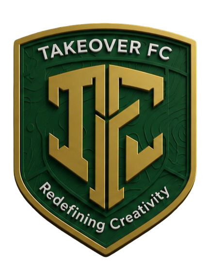

<div align="center">
  
  <h1>Takeover Creatives FC — Official Website</h1>
  <p><strong>Football With Purpose.</strong><br>
  Kampala, Uganda · Founded 2024 · Redefining Creativity Through Football</p>
</div>

---

The digital home of Takeover Creatives FC — a community-driven football club in
Kampala using football to develop young people, create opportunities and build a
stronger future.

Built to the club's Official Website Master Plan (`docs/`), which specifies the
brand direction, content architecture, page structure and standards this site is
measured against.

## Repository

A two-app monorepo:

| App | What it is | Deploys to |
|---|---|---|
| `apps/web` | The public Next.js website | Vercel |
| `apps/api` | Laravel 13 + Filament 5 content API and admin panel | Hostinger |

## Quick start

```bash
# The website
cd apps/web && npm install && npm run dev        # http://localhost:3000

# The admin panel and API
cd apps/api && composer install
cp .env.example .env && php artisan key:generate
touch database/database.sqlite
php artisan migrate --seed
php artisan serve                                 # http://localhost:8000/admin
```

Create an admin account:

```bash
cd apps/api && php artisan tinker --execute="
App\Models\User::create([
  'name' => 'Club Admin', 'email' => 'admin@takeoverfc.com',
  'password' => 'password', 'role' => 'admin', 'is_active' => true,
]);"
```

See [`docs/DEPLOYMENT.md`](docs/DEPLOYMENT.md) for putting both apps live.

### `apps/web`

| Script | What it does |
|---|---|
| `npm run dev` | Development server |
| `npm run build` | Production build |
| `npm start` | Serve the production build |
| `npm run lint` | ESLint, zero warnings tolerated |
| `npm run typecheck` | TypeScript, no emit |
| `npm run check:content` | Lists any placeholder still in the static content files |

### `apps/api`

| Command | What it does |
|---|---|
| `php artisan serve` | Runs the API and admin panel |
| `php artisan test` | Full test suite — panel rendering, roles, API shapes, revalidation |
| `php artisan migrate --seed` | Builds the database and loads the club's documented content |
| `php artisan db:seed --class=ClubSeeder` | Re-seeds content (safe to re-run) |

## Stack

- **Next.js 16** (App Router) with React 19 and TypeScript
- **Tailwind CSS v4** — design tokens defined in `src/app/globals.css`
- **next/font** — Inter for body, Anton as the condensed athletic display face
- **next/image** — automatic WebP/AVIF, responsive sizes, lazy loading
- No animation library: scroll reveals and counters are ~40 lines of
  `IntersectionObserver`, fully disabled under `prefers-reduced-motion`

Static-first — 53 routes prerender at build time. Only the pages that depend on
the current time (homepage, fixtures, teams) revalidate on a timer; everything
else rebuilds on demand when the admin panel says content changed.

### Backend

- **Laravel 13** with a read-only JSON API at `/api/v1`
- **Filament 5** admin panel at `/admin`, branded in the club's colours
- **Role-based access** (§65): admin, editor, media, viewer
- **On-demand revalidation** — saving a result pings the site to rebuild only
  the affected pages
- Runs on MySQL in production, SQLite locally

## Pages

| Route | Master plan |
|---|---|
| `/` | §10–20, full 14-section homepage wireframe (§60) |
| `/club` · `/club/leadership` | §21–25 |
| `/teams` | §26 |
| `/players` · `/players/[slug]` | §27–28 — filterable database + premium profiles |
| `/fixtures-results` · `/matches/[slug]` | §29–30 — tabs + match centre |
| `/news` · `/news/[slug]` | §31–32 |
| `/community` | §33–35 |
| `/academy` · `/girls-football` | §36–37 |
| `/partners` · `/partner-with-us` · `/support` | §38–40 |
| `/media` · `/gallery` · `/videos` | §41–43 |
| `/join` · `/contact` | §44–45 |
| `/privacy` · `/terms` | §9 footer |

## The admin panel

Lives at `/admin` on the backend and exists to satisfy §51: *"the club should not
need a developer every time someone needs to update a match result."*

| Group | Manages |
|---|---|
| **Football** | Fixtures & results, players, teams |
| **Newsroom** | News articles |
| **The Club** | Leadership & staff, partners |
| **Media** | Photo albums, videos |
| **Administration** | Panel users and roles |

The match form is the one built with most care: entering a fixture is four
fields, and the result, timeline, line-up, statistics and report sections stay
hidden until the match is actually marked as played.

Roles are enforced in code and covered by tests — a media user can publish news
but cannot edit the squad or create panel users.

## Design system

Colours are sampled from the club crest: emerald `#083018`, pyramid gold
`#A88838`, cream `#F7F2E6`. The full scale lives in the `@theme` block of
`src/app/globals.css`.

Two signature components carry the club's visual identity (§59):

- **The Takeover Line** — a thin emerald→gold gradient rule tracing the journey
  from player to team to community to club to future. It runs under the header,
  between sections, and appears on card hover.
- **The Takeover Grid** — a faint modular grid backing statistics, player cards,
  empty states and dark sections.

## Standards this site is built to

**Accessible** — semantic HTML, a skip link, visible gold focus rings on every
interactive element, labelled form fields, `aria-live` result counts, real
`role="tablist"` tabs, alt text on every meaningful image, and full
`prefers-reduced-motion` support.

**Fast** — static prerendering, no client-side animation library, optimised and
lazily-loaded images, `display: swap` fonts. The client JavaScript is limited to
the header, the countdown, the filters and two observers.

**Discoverable (§53)** — per-page titles, descriptions, canonical URLs and Open
Graph images; `sitemap.xml` and `robots.txt`; and JSON-LD structured data for
`SportsTeam`, `Person`, `SportsEvent`, `NewsArticle` and `BreadcrumbList`.

**Honest** — where the club has nothing to show yet, the site says so. The
partners page shows an open invitation rather than borrowed logos, the video hub
says the channel is being built, the league table says there is no table yet, the
academy says it has not opened, and player profiles show a crest avatar rather
than attributing a photograph to someone we cannot identify.

## ⚠️ Before this goes live

The master plan documents the club's identity, its communities and two named
players — but not a squad list, a fixture list, staff names or contact details.
Those sections are filled with **clearly-flagged placeholder data** so the design
could be built and reviewed.

The database seeder deliberately loads **only** the content the club can stand
behind — the two documented players, the real teams, the real articles and the
real photography. It does not seed the invented squad or fixtures the static
site shipped with. Those go in through the panel, as real data.

Before launch:

1. **Enter the real squad and staff** in the admin panel. The nine staff roles
   are seeded unpublished, so the panel shows exactly what needs filling in
   without publishing placeholder people.
2. **Enter real fixtures.** The site already handles an empty fixture list —
   it shows "The next chapter is being built."
3. **Replace the contact details and social links**, currently placeholders in
   `apps/web/src/content/site.ts` and in the panel's settings.
4. **Set `site.url`** to the real domain. It drives every canonical URL, sitemap
   entry and share card.
5. **Have the privacy policy and terms reviewed** against Uganda's Data
   Protection and Privacy Act. Both pages carry a visible notice until then.

`apps/web/CONTENT.md` explains the static content files; anything already moved
to the API is edited in the panel instead.

## Repository layout

```
apps/
  web/                      Next.js site
    src/app/                Routes, sitemap, robots, icons
    src/components/         UI library
    src/content/            Static content (being migrated to the API)
    src/lib/                Types (§52 entity spec), SEO helpers
    public/images/          Web-ready photography (≤2400px)
  api/                      Laravel backend
    app/Models/             §52 entities — Player, Fixture, Article, Partner…
    app/Filament/           Admin panel resources, forms and tables
    app/Http/               JSON API controller and resources
    database/seeders/       ClubSeeder — the club's documented content
    tests/Feature/          Panel, roles, API shapes, revalidation
assets/raw/                 Original camera files incl. RAW — git-ignored
docs/                       Master plan and DEPLOYMENT.md
```

## Deploying

See [`docs/DEPLOYMENT.md`](docs/DEPLOYMENT.md) — it covers the Hostinger hPanel
specifics (keeping `.env` above the web root, cron for the scheduler and queue,
PHP settings) and the one Vercel setting that matters: **Root Directory must be
`apps/web`**, or the build fails.

---

<div align="center">
  <sub>Takeover Creatives Uganda · Redefining Creativity Through Football</sub>
</div>
